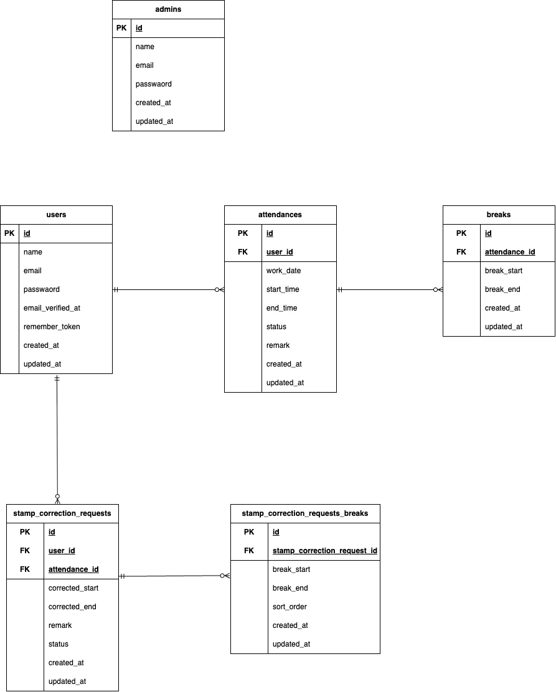

# 勤怠管理アプリ（kintai-app）

## 📦環境構築

### Dockerのビルド
```bash
git clone git@github.com:satomayuko/kintai-app.git
cd kintai-app
docker-compose up -d --build
```
### laravel環境構築
```
docker-compose exec php bash
composer install
```
### envファイルの作成と設定
```
cp .env.example .env
```
.env ファイルには以下のように設定します
```env
DB_CONNECTION=mysql
DB_HOST=mysql
DB_PORT=3306
DB_DATABASE=laravel_db
DB_USERNAME=laravel_user
DB_PASSWORD=laravel_pass
```

### アプリケーションキーの生成
アプリケーションキーを生成し .env に自動設定します：
```
docker-compose exec php bash
php artisan key:generate
```

### データベースマイグレーション（Migration）
下記コマンドでマイグレーション、シーディングを実行します
```
docker-compose exec php bash
php artisan migrate:fresh --seed
```
## メール認証

開発環境のメール送信確認には MailHog を使用しています。

MailHog（Web UI）：http://localhost:8025

`.env` は以下のように設定してください。
```
MAIL_MAILER=smtp
MAIL_HOST=mailhog
MAIL_PORT=1025
MAIL_USERNAME=null
MAIL_PASSWORD=null
MAIL_ENCRYPTION=null
MAIL_FROM_ADDRESS=no-reply@example.com
MAIL_FROM_NAME="${APP_NAME}"
```
ユーザー登録後、MailHog に届いたメールを開き、認証リンクをクリックして動作確認します。

## テストアカウント

※ php artisan migrate:fresh --seed 実行後に利用できます。

### 管理者
- name : 管理者
- email : admin@example.com
- password : password123

### 一般ユーザー
- name : テスト太郎
- email : taro@example.com
- password : password123

- name : テスト花子
- email : hanako@example.com
- password : password123

- name : テスト次郎
- email : jiro@example.com
- password : password123

## PHPUnit
```
docker-compose exec mysql bash
mysql -u root -p

パスワードは root
create database test_database;

docker-compose exec php bash
php artisan migrate:fresh --env=testing
./vendor/bin/phpunit
```
## テーブル仕様書
### usersテーブル
| カラム名 | 型 | PK | UK | NOT NULL | FK |
|---|---|---:|---:|---:|---|
| id | unsigned bigint | ◯ |  | ◯ |  |
| name | varchar(255) |  |  | ◯ |  |
| email | varchar(255) |  | ◯ | ◯ |  |
| email_verified_at | timestamp |  |  |  |  |
| password | varchar(255) |  |  | ◯ |  |
| remember_token | varchar(100) |  |  |  |  |
| created_at | timestamp |  |  |  |  |
| updated_at | timestamp |  |  |  |  |

### adminsテーブル
| カラム名 | 型 | PK | UK | NOT NULL | FK |
|---|---|---:|---:|---:|---|
| id | unsigned bigint | ◯ |  | ◯ |  |
| name | varchar(255) |  |  | ◯ |  |
| email | varchar(255) |  | ◯ | ◯ |  |
| password | varchar(255) |  |  | ◯ |  |
| created_at | timestamp |  |  |  |  |
| updated_at | timestamp |  |  |  |  |

### attendancesテーブル
※ UNIQUE(user_id, work_date)

| カラム名 | 型 | PK | UK | NOT NULL | FK |
|---|---|---:|---:|---:|---|
| id | unsigned bigint | ◯ |  | ◯ |  |
| user_id | unsigned bigint |  |  | ◯ | users(id) |
| work_date | date |  |  | ◯ |  |
| start_time | time |  |  |  |  |
| end_time | time |  |  |  |  |
| status | varchar(20) |  |  | ◯ |  |
| remark | varchar(255) |  |  |  |  |
| created_at | timestamp |  |  |  |  |
| updated_at | timestamp |  |  |  |  |

### breaksテーブル
| カラム名 | 型 | PK | UK | NOT NULL | FK |
|---|---|---:|---:|---:|---|
| id | unsigned bigint | ◯ |  | ◯ |  |
| attendance_id | unsigned bigint |  |  | ◯ | attendances(id) |
| break_start | datetime |  |  |  |  |
| break_end | datetime |  |  |  |  |
| created_at | timestamp |  |  |  |  |
| updated_at | timestamp |  |  |  |  |

### stamp_correction_requestsテーブル
| カラム名 | 型 | PK | UK | NOT NULL | FK |
|---|---|---:|---:|---:|---|
| id | unsigned bigint | ◯ |  | ◯ |  |
| user_id | unsigned bigint |  |  | ◯ | users(id) |
| attendance_id | unsigned bigint |  |  | ◯ | attendances(id) |
| corrected_start | time |  |  |  |  |
| corrected_end | time |  |  |  |  |
| remark | varchar(255) |  |  | ◯ |  |
| status | tinyint |  |  | ◯ |  |
| created_at | timestamp |  |  |  |  |
| updated_at | timestamp |  |  |  |  |

### stamp_correction_request_breaksテーブル
| カラム名 | 型 | PK | UK | NOT NULL | FK |
|---|---|---:|---:|---:|---|
| id | unsigned bigint | ◯ |  | ◯ |  |
| stamp_correction_request_id | unsigned bigint |  |  | ◯ | stamp_correction_requests(id) |
| break_start | time |  |  |  |  |
| break_end | time |  |  |  |  |
| sort_order | int |  |  | ◯ |  |
| created_at | timestamp |  |  |  |  |
| updated_at | timestamp |  |  |  |  |

## 🔧 使用技術
- PHP 8.1.34
- Laravel 8.83.8
- MySQL 8.0.26
- Nginx 1.21.1
- MailHog
- phpMyAdmin
- Docker（環境構築用：nginx, php, mysql）
## 🗺 ER図


## 🌐URL
- 一般ユーザー：http://localhost/login
- 管理者：http://localhost/admin/login
- MailHog：http://localhost:8025
- phpMyAdmin：http://localhost:8080